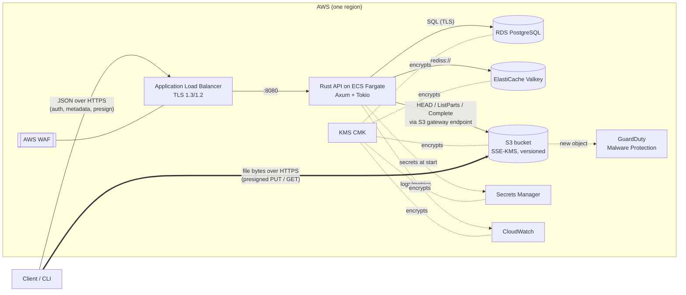
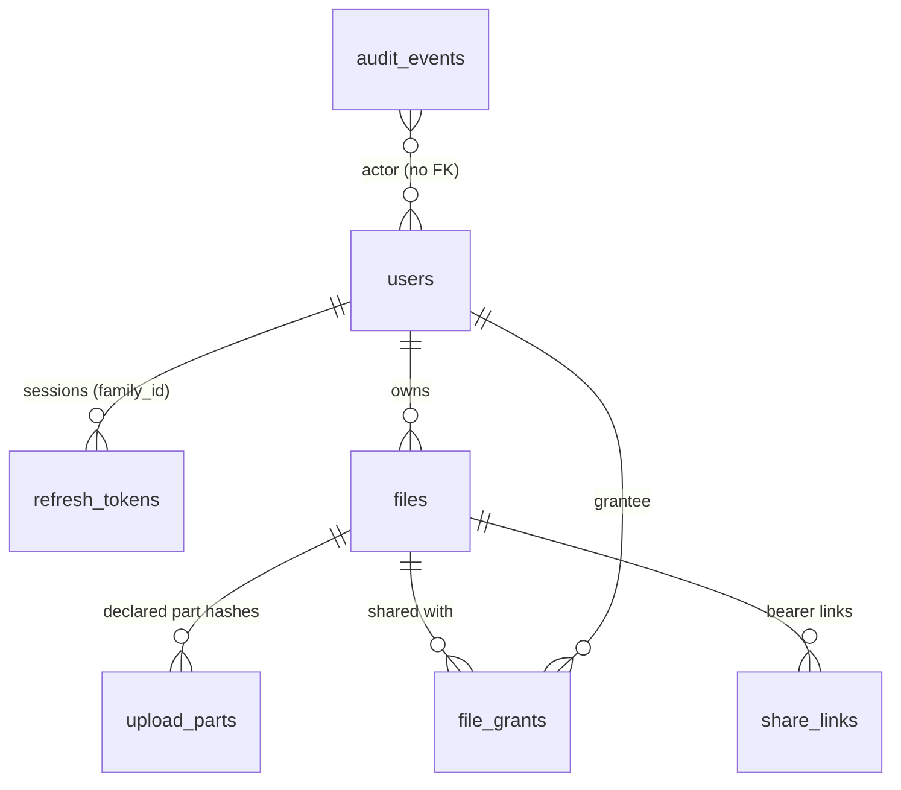

# SecureDrop architecture

## Overview
SecureDrop is a file-transfer service whose API **never handles file bytes**. The Rust API authenticates users, enforces policy, keeps metadata, and issues short-lived **presigned S3 URLs**. Clients upload to and download from S3 directly.



## Upload flow
```mermaid
sequenceDiagram
    autonumber
    participant C as Client
    participant A as API
    participant D as Postgres
    participant S as S3
    C->>A: POST /uploads {name, type, size, sha256}
    A->>A: validate name/type/size, sanitise
    A->>D: BEGIN; lock user row; check quota; INSERT files(pending); COMMIT
    alt size ≤ 64 MiB
        A->>A: presign PUT (signs Content-Length, Content-Type, x-amz-checksum-sha256)
        A-->>C: {file_id, single: {url, headers}}
        C->>S: PUT bytes (S3 verifies signature, length, SHA-256)
    else multipart
        A->>S: CreateMultipartUpload (SHA-256 checksums)
        A-->>C: {file_id, multipart: {part_size, part_count}}
        loop each part (parallel, resumable)
            C->>A: POST /uploads/{id}/parts {n, sha256}
            A-->>C: presigned UploadPart URL
            C->>S: PUT part (S3 verifies part SHA-256)
        end
    end
    C->>A: POST /uploads/{id}/complete
    A->>S: (multipart) ListParts → CompleteMultipartUpload(declared checksums)
    A->>S: HEAD (size, checksum) + GET bytes=0-511 (magic-byte sniff)
    A->>D: UPDATE files SET status='available' WHERE status='pending'
    A-->>C: {status: available}
```

## Download flow
1. `GET /files/{id}/download` (owner or grantee) or `POST /shared/download {token}` (share link).
2. Authorisation goes through `files::authz::load_authorized` (owner/grantee/stranger policy). Share links are validated and counted in one atomic `UPDATE`.
3. The API presigns a GET with a short TTL (5 min, or 60 s for share links) and **signed response overrides** `Content-Disposition: attachment` and `Content-Type`.
4. The client streams from S3, hashes while writing to a temp file, and renames into place only if the SHA-256 matches.

## Components

| Component | Responsibility | Key code |
|---|---|---|
| `crates/api` | HTTP API, auth, policy, metadata, presigning, cleanup worker | `src/{auth,files,shares,storage,middleware,telemetry}` |
| `crates/common` | Request/response types shared by server and clients | `src/lib.rs` |
| `crates/cli` | Client library + `securedrop` binary | `src/{client,transfer,credentials}.rs` |
| PostgreSQL | Users, sessions (refresh-token families), files, parts, grants, links, audit log | `crates/api/migrations` |
| Redis/Valkey | Distributed rate limiting (GCRA), revoked-session denylist | `middleware/rate_limit.rs`, `auth/revocation.rs` |
| S3 | File bytes, encrypted with SSE-KMS; versioned | `storage/s3.rs`, `infra/terraform/modules/s3` |

## Data model

File lifecycle: `pending → available → deleted`, or `pending → failed`. Every transition is a compare-and-set `UPDATE ... WHERE status = <expected>`.

## Key decisions (ADR summary)

| # | Decision | Alternatives | Rationale |
|---|---|---|---|
| 1 | Presigned URLs; the API never proxies bytes | Stream through the API | Bandwidth and memory independent of file size; S3 enforces size and hash via signed headers |
| 2 | JWT access (15 min) + rotating opaque refresh tokens; revocation by session id in Redis | Server sessions only; long-lived JWTs | Stateless hot path *and* immediate revocation; reuse detection catches token theft |
| 3 | Argon2id (19 MiB, t=2) behind a semaphore | bcrypt, scrypt | OWASP first choice; the semaphore prevents memory-exhaustion DoS |
| 4 | Client-declared SHA-256 signed into URLs, then re-verified | Trust the client's "done" | Integrity enforced by S3 at write time, checked again on completion |
| 5 | Central pure-function authz; 404 for strangers | Per-handler checks; 403 | One auditable policy; no existence oracle |
| 6 | GCRA rate limiting in Redis (Lua, Redis clock) | In-memory limiter; fixed windows | Correct across replicas; O(1) state; no boundary bursts |
| 7 | Postgres `FOR UPDATE SKIP LOCKED` cleanup in every replica | Separate scheduler; leader election | No extra infrastructure; replicas share the work safely |
| 8 | Distroless non-root image, read-only rootfs | Debian slim, Alpine | Minimal attack surface; glibc performance |
| 9 | Terraform ephemeral values + write-only args for secrets | `random_password` in state | Secrets never stored in state or plan files |
| 10 | Keyless CI/CD via GitHub OIDC | Access keys in GitHub secrets | Nothing long-lived to leak or rotate |

## Failure behaviour

| Failure | Effect | Why |
|---|---|---|
| Redis down | Auth endpoints → 503 (rate limiter and denylist fail closed); authenticated requests → 503 (denylist check fails closed) | Security over availability for authentication |
| Postgres down | `/readyz` 503, so the ALB stops routing; `/healthz` 200, so ECS doesn't restart-storm | Separate liveness from readiness |
| S3 slow or down | Presign still works (offline signing); completion/readiness fail with timeouts | Bounded request timeout (15 s), per-check readiness timeouts |
| Client abandons upload | Cleanup worker fails it after 24 h, purges storage, releases quota; S3 lifecycle aborts parts after 1 day | Two independent mechanisms |
| Bad deploy | ECS circuit breaker rolls back | Health checks gate traffic |
